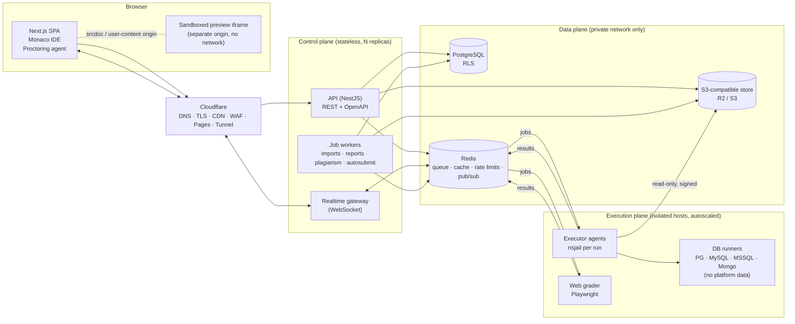
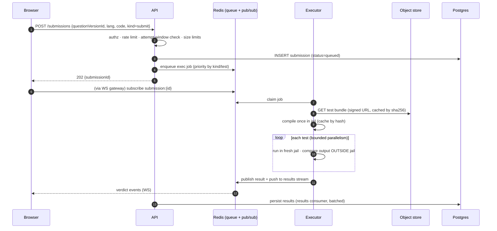
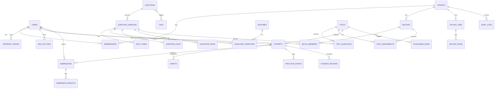
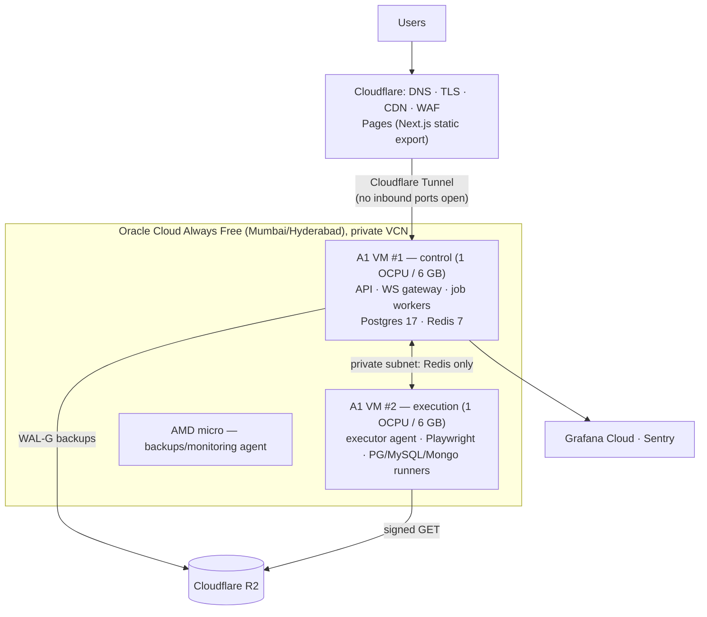
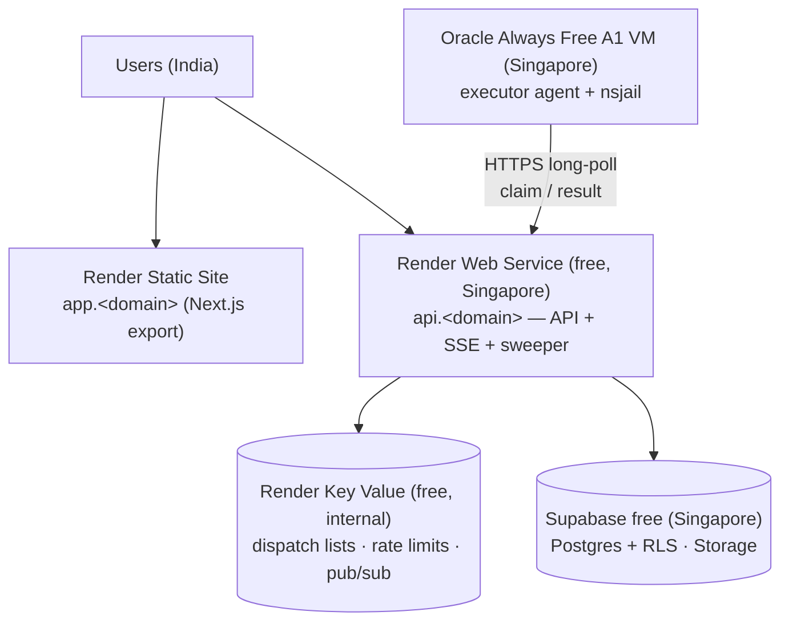
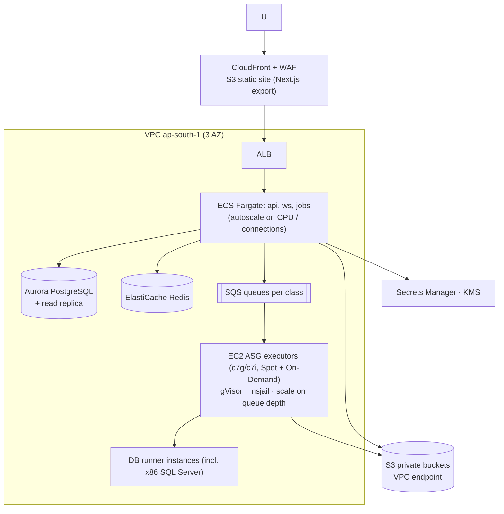

# HBECode — Architecture (Phase 1)

> Status: approved Phase 1 design; decision logs for later phases are in §15.4–15.7.
> Date: 2026-10-01. Companion document: [`threat-model.md`](./threat-model.md).

## Contents

1. [Goals and non-goals](#1-goals-and-non-goals)
2. [Assumptions](#2-assumptions)
3. [Open questions (need your decision)](#3-open-questions-need-your-decision)
4. [System overview](#4-system-overview)
5. [Technology decisions](#5-technology-decisions)
6. [Code execution engine and sandbox design](#6-code-execution-engine-and-sandbox-design)
7. [Web and DB question engines](#7-web-and-db-question-engines)
8. [Data model / ERD](#8-data-model--erd)
9. [Multi-tenancy, RBAC and audit](#9-multi-tenancy-rbac-and-audit)
10. [API outline](#10-api-outline)
11. [Realtime, proctoring and test lifecycle](#11-realtime-proctoring-and-test-lifecycle)
12. [Question formats](#12-question-formats)
13. [Reporting pipeline](#13-reporting-pipeline)
14. [Performance and capacity model](#14-performance-and-capacity-model)
15. [Free-tier hosting: limits and plan](#15-free-tier-hosting-limits-and-plan)
16. [AWS target architecture and migration](#16-aws-target-architecture-and-migration)
17. [Observability, CI/CD](#17-observability-cicd)
18. [Repository layout](#18-repository-layout)
19. [Phase plan and exit criteria](#19-phase-plan-and-exit-criteria)

---

## 1. Goals and non-goals

**Goals**
- A multi-tenant coding-assessment platform: browser IDE, sandboxed execution against hidden tests,
  proctored timed tests, question bank with bulk import, and tenant-scoped reports.
- 5,000+ concurrent test-takers. Getting there means **adding executor nodes and changing config**.
  It must not need a rewrite.
- p95 UI interaction (API round trip for non-execution calls) < 200 ms in-region.
  Simple-program submission feedback in ~2–3 s end-to-end at normal load.
- Run on free tiers now and move to AWS later. Every external dependency sits behind a port
  (interface) with a swappable adapter.

**Non-goals (for now)**
- Native mobile apps, a lockdown browser, or live human video proctoring.
- Multi-region active-active. We start single-region, and the design allows read replicas later.
- Building our own SSO IdP. OIDC/SAML for clients is planned as a later add-on.

## 2. Assumptions

These are decisions I made so I could keep going. Each one is cheap to change now and expensive later, so please check them.

| # | Assumption | Why it matters |
|---|---|---|
| A1 | Primary users and institutions are in **India**. The single region is **Mumbai/Hyderabad** (Oracle `ap-mumbai-1`/`ap-hyderabad-1` now, AWS `ap-south-1` later). | Latency budget, data residency (DPDP Act 2023). |
| A2 | "Concurrent user" means a logged-in student actively coding in a test. They hit Run about every 90 s and Submit about every 5 min, and **everyone submits in the last ~3 minutes** (worst case). | Sizes the executor fleet (§14). |
| A3 | Users belong to tenants through **memberships**. One person can be a Teacher in tenant A and a Student in tenant B. Super Admins and Guests have no tenant. | Data model and RBAC. |
| A4 | The global question bank (`tenant_id IS NULL`) is owned by Super Admins and readable by every tenant. A Teacher's questions are private to their tenant unless a Super Admin promotes them to global. | RLS policies. |
| A5 | Guests are anonymous sessions. Code they run is kept ≤ 24 h, they get the strictest rate limits, and they never see tests. | Abuse surface. |
| A6 | Questions are **versioned and immutable once published**. A test pins `question_version_id`, so editing a question never changes a test that is live or finished. | Report correctness. |
| A7 | **One TypeScript stack** (Next.js, NestJS, executor agent) with Zod schemas shared across all of them. I chose this over Go because BullMQ is Node-native, and one toolchain is cheaper for a small team. The executor is a thin orchestrator. The real isolation work is done by `nsjail` and the kernel. | Team velocity. A Go executor stays possible behind the same queue contract. |
| A8 | ORM: **Drizzle** (parameterized SQL, typed, no binary engine). It makes per-transaction `SET LOCAL app.tenant_id` for RLS easy. | Prisma also works but needs an extension that wraps every query in a transaction. |
| A9 | Next.js runs as a **static export** (client-rendered app shell) on Cloudflare Pages. Authenticated pages don't need SSR, static assets are free and unlimited there, and the API is the only dynamic origin. | Free hosting, simpler CSP. |
| A10 | The webcam feature uses client-side face detection (MediaPipe). It **uploads only flagged frames** by default, with 90-day retention, and asks for explicit consent at test start. | PII minimisation. |
| A11 | **Executor nodes are x86_64 _and_ ARM64** (multi-arch images). The free-tier executor is ARM64 (Oracle Ampere). | See Q1, because SQL Server has no native ARM64 build. |
| A12 | React question grading runs the critical checks in **Playwright against a bundled app**. Jest + React Testing Library is used only for unit-level checks. Reason: tests that run in the same process as the student's code can be tampered with (§7.1). | Deviation from the brief, recorded here on purpose. |

## 3. Open questions (need your decision)

I only ask where a wrong guess is expensive:

- **Q1 — T-SQL on the free tier.** SQL Server for Linux needs **x86_64 and ≥ 2 GB RAM**. Azure SQL Edge,
  the old ARM64 option, was retired on 2025-09-30. The only free x86 VMs (Oracle AMD micro) have 1 GB.
  Options:
  (a) defer T-SQL questions until a paid x86 node exists (~US$10–15/mo, or AWS later);
  (b) emulate T-SQL with **Babelfish for PostgreSQL**, which is only partly compatible and would mislead students;
  (c) pay for one small x86 VM now.
  **My recommendation: (c) if there is any budget, otherwise (a).** Until then, T-SQL questions are authored and validated in local Docker on x86 only.
- **Q2 — Region and data residency.** Is India-only hosting acceptable or required? (A1)
- **Q3 — Concurrent logins.** When a student opens the same test on a second device, should we
  (a) block the new device until a proctor approves it, or (b) take over and kill the old session (logged as a violation)?
  Default if you don't say: **(a) block**, configurable per test.
- **Q4 — Branding and domains.** We need two registrable domains: one for the app
  (e.g. `hbecode.app`) and a **separate** one for untrusted user-content previews
  (e.g. `hbecode-usercontent.app`). Do you already have domains?

---

## 4. System overview



**Key properties**
- The API and realtime gateway keep no state. Sessions, rate limits, presence and pub/sub live in Redis,
  so any replica can serve any request.
- Executors **do not talk to PostgreSQL**. They get a job from the queue, fetch test data through
  short-lived signed URLs (and cache it locally by content hash), and push results back to Redis.
  The API/job tier persists the results. This keeps a sandbox escape far away from platform data.
- DB runner instances are separate database servers that hold only throwaway question data.
  They have no network route to the platform database.

### 4.1 Submission flow



---

## 5. Technology decisions

| Concern | Choice | Notes / reason |
|---|---|---|
| Frontend | Next.js (App Router, static export) + TypeScript + Tailwind + Monaco (self-hosted, no CDN) | Static export: see A9. Monaco is loaded from our own origin so CSP can stay `script-src 'self'`. |
| API | NestJS + Fastify adapter | Guards and interceptors give one enforced place for authn, RBAC and tenant context. Fastify is faster than Express. |
| Validation / contracts | Zod in `packages/shared`, exported to OpenAPI 3.1 | One schema drives the client types, server validation and the OpenAPI spec. |
| DB | PostgreSQL 17 + Drizzle ORM + RLS | Parameterized queries only. A lint rule bans `sql.raw` outside the migrations package. |
| Cache/queue | Redis 7 + BullMQ, behind a `JobQueue` port | SQS adapter later (§16). Queues are split by class: `exec-run`, `exec-submit`, `exec-validate`, `web-grade`, `db-grade`, `jobs-*`. |
| Realtime | `ws` gateway (NestJS) + Redis pub/sub | 5,000 sockets is a light load for 2 Node replicas. Clients fall back to polling. |
| Object store | S3 API (R2 now, S3 later), behind a `BlobStore` port | Private buckets only. All access goes through presigned URLs that expire in ≤ 5 min. |
| Sandbox | **Custom runner: nsjail + per-language images.** gVisor (`runsc`) as an optional outer layer on AWS. | Rationale in §6.1. |
| Web grading | Playwright (Chromium), pinned | |
| Auth | Argon2id, ES256 JWT (10 min) + rotating refresh (14 d) with reuse detection, TOTP MFA | Details in the threat model. |
| Load testing | k6 (WebSocket + HTTP scenarios) | |
| Plagiarism | Winnowing (MOSS algorithm) over tree-sitter-normalised token streams | Written in-house. That avoids GPL licensing (JPlag) and the external service (MOSS). |

---

## 6. Code execution engine and sandbox design

### 6.1 Judge0 vs Piston vs custom

| Criterion | Judge0 CE | Piston | Custom (nsjail) — **recommended** |
|---|---|---|---|
| License | GPL-3.0 | MIT | Ours (nsjail: Apache-2.0) |
| Isolation primitive | `isolate` | `isolate` | `nsjail` (namespaces, cgroup v2, seccomp-bpf via Kafel, rlimits, mount control) |
| Security history | **CVE-2024-28185 / -28189 (CVSS 10)**: sandbox escape to root via symlinks in the sandbox dir. Fixed in 1.13.1. | Requires a privileged container. Fewer public audits. | We own the attack surface and must test it ourselves (Phase 8 escape suite). |
| Host requirements | Historically cgroup v1 only. Fails on modern cgroup-v2 hosts. Privileged container. | cgroup v2 only. Privileged container. | cgroup v2. Container needs `CAP_SYS_ADMIN` only for jail setup, or uses unprivileged user namespaces where the kernel allows. |
| Multi-file / driver concat / custom comparators | Partial (`additional_files`, custom checker hacks) | Multi-file yes. No comparators, no test batching. | Designed for it |
| Per-test verdicts, CPU vs wall time, memory peak | Yes | Partial | Yes (cgroup `cpu.stat`, `memory.peak`) |
| Compile once, run N tests | No (one submission = one test) | No | Yes. Built into the job model. |
| Web / DB questions | No | No | Same job contract, different runner types |
| Hosted option | Paid RapidAPI | Public API closed to the public since 2026-02-15 (whitelist only) | n/a |
| Effort | Low to integrate, high to bend | Low to integrate, medium to bend | Highest to build (≈ 2–3 weeks in Phase 2) |

**Recommendation: build a custom runner on nsjail.** The deciding factors are:
- Judge0's recent CVSS 10 sandbox escapes and its cgroup v1 requirement.
- Both projects use a one-test-per-request model. "Compile once, run 15 tests" is essential for the
  2–3 s target and for cost.
- We need first-class drivers, comparators and output caps that run **outside** the jail.

Piston's per-language package scripts are a good reference for building the runtime images.

### 6.2 Executor layout

```
Executor host (VM, dedicated to untrusted code; no route to the data plane except Redis + object store)
└── executor-agent container  (non-root, read-only rootfs, seccomp default, cap-drop ALL + SYS_ADMIN for nsjail)
    ├── warm pool: one long-lived "toolchain" image mount per language (read-only)
    └── per run: nsjail
          · new user, PID, mount, IPC, UTS, cgroup and NET namespaces (net ns has no interfaces → no network)
          · uid/gid 65534 inside, no setuid binaries, no_new_privs
          · rootfs = read-only bind of the language toolchain; /box = fresh tmpfs (size-capped)
          · cgroup v2: memory.max, memory.swap.max=0, pids.max (64; 256 for JVM/.NET), cpu.max
          · rlimits: RLIMIT_FSIZE (output file size), NOFILE, STACK, CORE=0
          · seccomp-bpf allowlist per language family (deny ptrace, mount, keyctl, bpf, perf_event_open,
            unshare/setns, socket families other than AF_UNIX, etc.)
          · stdout/stderr go to pipes read by the agent with a hard byte cap (e.g. 64 KiB visible; 8 MiB compare cap)
          · wall-clock kill = 2 × time limit + 1 s; verdict uses CPU time from cpu.stat
          · after exit: kill the cgroup, unmount, wipe tmpfs — nothing survives between runs
```

- **Fork bombs:** stopped by `pids.max`, and the cgroup is killed when the run finishes.
  **Infinite output:** the pipe reader stops at the cap and kills the run with verdict `OLE`.
  **Filesystem escape:** a read-only root, a tmpfs work dir, no symlink-following writes by the agent
  (the agent never writes into a directory the student controls after the jail starts), and `O_NOFOLLOW`
  on every file the agent reads back.
- **Defense in depth (AWS):** the executor container runs under gVisor `runsc`, and executor nodes sit
  in their own subnet and security group. They have no IAM rights except reading one bucket prefix,
  and egress only to Redis and the S3 VPC endpoint. Nodes are recycled every N hours.
- **Agent hygiene:** the warm container is recycled after N runs or on any unexpected jail exit. The agent
  restarts itself if its own memory grows.

### 6.3 Job contract (shared by every runner type)

```ts
// packages/shared/src/exec/job.ts (sketch)
type ExecJob = {
  jobId: string; submissionId: string; kind: 'run' | 'submit' | 'validate';
  runtime: { id: 'cpp17-gcc13'; imageDigest: string };   // pinned
  sources: { student: string; driverRef?: BlobRef };      // driver fetched by agent, never sent via client
  tests: { id: string; inputRef: BlobRef; expectedRef?: BlobRef; hidden: boolean }[];
  customInput?: string;                                     // 'run' only, size-capped
  limits: { cpuMs: number; wallMs: number; memMb: number; outputKb: number };
  compare: { mode: 'exact' | 'trim_trailing' | 'unordered_lines' | 'float'; epsilon?: number };
  deadlineAt: string;                                       // job is dropped if expired
};
```

The result has one verdict per test: `AC | WA | TLE | MLE | RE | OLE | CE | IE`, plus `cpuMs` and `memKb`.
The API strips everything except the verdict for hidden tests **before** a result is stored in the
client-visible projection.

### 6.4 Drivers, stubs, hidden data

- The student sees only the **stub**. At runtime the agent builds the source from (student code + driver)
  using a per-language strategy. Examples: one file with the driver appended (C, C++, Go, Rust, JS, Python),
  `Main.java` + `Solution.java` (Java), or partial classes (C#).
  Line numbers in compile errors are remapped to the student's file, and driver lines are **never echoed**.
  A compile error whose location is inside the driver is shown as a generic "signature mismatch" message.
- Expected outputs **never enter the jail**. Comparison runs in the agent, outside the jail.
- Reference solutions are executed only by `validate` jobs. They are never placed next to student code.
- Hidden test I/O is stored in a private bucket under `tests/{sha256}`. Only executors can read that
  prefix (on AWS, through an IAM role scoped to that prefix). API responses for students never include
  test refs.
- **Known side channel:** student code can read the hidden input from stdin, and it could leak a few bits
  per submission by choosing to pass or fail. Mitigations: hidden tests show verdicts only (no timing),
  submit rate limits, per-test verdict shuffle in test mode (optional), and anomaly flags for very high
  submit counts.

### 6.5 Languages and pinned versions (proposal — confirmed in Phase 2 by the image build)

| Language | Runtime (pinned) | Compile | Time × | Notes |
|---|---|---|---|---|
| C | GCC 13.x, `-std=c17 -O2` | yes | 1.0 | |
| C++ | GCC 13.x, `-std=c++17 -O2` | yes | 1.0 | Precompiled `bits/stdc++.h` header cuts compile from ~1.5 s to ~0.4 s |
| Java | Eclipse Temurin 21 LTS | `javac` | 2.0 | AppCDS archive + `-XX:TieredStopAtLevel=1 -Xshare:on` to cut JVM startup |
| Python | CPython 3.12 | no | 3.0 | |
| JavaScript | Node.js 22 LTS | no | 2.5 | |
| Go | Go 1.23 | yes | 1.5 | Warm build cache inside the read-only toolchain |
| Rust | rustc 1.8x stable, `-O` | yes | 1.5 | Compile ~0.8–1.5 s. The compile cache matters most here. |
| C# | .NET 8 LTS (calls `csc.dll` directly, no `dotnet build`) | yes | 2.0 | Skipping MSBuild cuts ~2 s |
| Pandas | CPython 3.12 + pandas 2.2 + numpy 2.x | no | 3.0 | |

The exact versions (and image digests) live in a `runtimes` table and are shown in the IDE's language picker.

### 6.6 Latency tactics
- **Compile cache** keyed by `sha256(runtime digest + student source + driver)`. Run → Submit with the same code skips compiling.
- **Test bundles cached** on the executor's local disk by content hash, so a hot cache needs no object-store round trip.
- **Bounded parallelism** within a submission: up to 4 test jails at once on separate cores. This keeps CPU-time measurements stable.
- **Priority:** `run` jobs and in-test `submit` jobs come first. Practice and guest jobs come next. Validation and bulk import jobs run last on separate queues.

---

## 7. Web and DB question engines

### 7.1 Web (HTML / CSS / JS / React)
- **Editor:** multi-file Monaco (`index.html`, `styles.css`, `script.js` / `App.jsx`, …).
- **Live preview:** a `<iframe sandbox="allow-scripts">` (no `allow-same-origin`) whose `srcdoc`
  starts with `<meta http-equiv="Content-Security-Policy" content="default-src 'none'; style-src 'unsafe-inline'; script-src 'unsafe-inline'; img-src data:">`.
  Student content comes after it, and a later meta tag can only add restrictions, never relax them.
  The preview gets an opaque origin, has no network access and cannot reach the app's cookies or DOM.
  React previews are bundled in a Web Worker with `esbuild-wasm`, which loads only for React questions. React/ReactDOM come from vendored local files.
- **Grading:** a `web-grade` job runs in a network-less container. It serves the files from an
  in-container static server and drives Chromium (with its own sandbox enabled) through Playwright.
  Checks run **from the Node side** (locators, `getComputedStyle` through a utility world, axe-core for a11y,
  viewport changes for responsive breakpoints, simulated events). Page JavaScript cannot fake the results.
- **React:** critical checks are Playwright checks against the esbuild bundle (A12). Optional Jest + RTL
  unit checks run in a separate jailed Node process. Their results are marked "unit" and weighted lower,
  because in-process tests can be tampered with by the code under test.

### 7.2 DB / Data
| Dialect | Isolation per test case |
|---|---|
| PostgreSQL 17 | `CREATE DATABASE run_x TEMPLATE q_{case_sha}` (pre-built template per dataset). Connect as `sbx_ro` / `sbx_dml` (NOSUPERUSER, no `pg_read_server_files`/`pg_execute_server_program`, `statement_timeout`, `temp_file_limit`, `work_mem` caps). Drop the database after the run. |
| MySQL 8.4 LTS | MySQL DDL is non-transactional, so each run gets its own schema built from the seed. The user has grants **only** on that schema. No `FILE` privilege, `local_infile=OFF`, `secure_file_priv` set to an empty dir, `max_execution_time`. The schema is dropped after the run. |
| SQL Server 2022 (T-SQL) | A contained database per run, created from a snapshot or backup. The user has rights on that database only. `xp_cmdshell`, CLR and OLE Automation are off, and there are resource governor limits. **x86 only, see Q1.** |
| MongoDB 8.0 | The student submits a query or aggregation pipeline as EJSON. The harness parses it (no JS eval) and rejects `$where`, `$function` and `$accumulator`, plus `$out`/`$merge` on read-only questions. `security.javascriptEnabled=false`. Each run gets its own database, dropped afterwards. |
| Pandas | A normal Python jail. The student function returns a DataFrame/Series, which the harness serialises to Arrow **inside** the jail. A trusted comparator compares it **outside** the jail with tolerance, dtype, index and order rules. |

- DB runner servers are **separate instances** with no platform data, reachable only from executor hosts.
  Result sets are capped (rows and bytes).
- **DML questions:** after the student's statements run, the harness runs the hidden "state queries"
  for that test case and compares the resulting table state.
- **Comparison rules** for each test case: `orderSensitive`, `columnNames: exact|ignore_case|ignore`,
  `columnTypes: strict|loose`, `floatEpsilon`, `nullEqualsNull`.

---

## 8. Data model / ERD

Every tenant-scoped table has `tenant_id` and RLS (§9). High-volume tables (`submissions`,
`submission_results`, `proctor_events`, `audit_logs`) are **range-partitioned by month**.



**Main tables (columns abbreviated)**

| Table | Key columns |
|---|---|
| `tenants` | id, name, slug, status, settings jsonb, retention_days, created_at |
| `users` | id, email citext unique, name, password_hash (argon2id), is_platform_admin, locked_until, failed_logins, last_login_at |
| `memberships` | (user_id, tenant_id) PK, role enum(`client_admin`,`teacher`,`associate`,`student`), status |
| `refresh_tokens` | id, user_id, family_id, token_hash, expires_at, rotated_at, revoked_at, ip, ua_hash |
| `batches` / `batch_members` / `batch_teachers` | tenant_id, name, year · (batch_id, user_id) |
| `questions` | id, tenant_id NULL=global, type enum(`coding`,`web`,`db`), slug, status enum(`draft`,`validating`,`invalid`,`published`,`archived`), current_version_id, content_hash, created_by |
| `question_versions` | id, question_id, version_no, title, statement_md, constraints_md, input_format_md, output_format_md, difficulty enum(`easy`,`moderate`,`hard`), time_complexity, space_complexity, base_time_limit_ms, memory_limit_mb, compare jsonb, type_spec jsonb (web/db specifics), published_at, search_tsv |
| `test_cases` | id, question_version_id, visibility enum(`sample`,`hidden`), ordinal, input_ref, expected_ref, explanation_md (samples), weight, is_stress, sha256, size_bytes, spec jsonb (DB dataset / web check definition) |
| `language_templates` | question_version_id, runtime_family, stub_code, driver_ref 🔒, solution_ref 🔒, signature jsonb |
| `runtimes` | id, family, display_name, version, image_digest, time_multiplier, mem_overhead_mb, enabled |
| `validation_runs` | id, question_version_id, status, report jsonb (per runtime × per test), started_at, finished_at |
| `tests` | id, tenant_id, title, starts_at, ends_at, duration_min, allowed_runtimes, proctoring jsonb, status, created_by |
| `test_questions` | test_id, question_version_id, points, ordinal |
| `test_assignments` | test_id, batch_id or user_id |
| `attempts` | id, tenant_id, test_id, user_id, status, started_at, deadline_at, submitted_at, score, violation_level, active_session_id, ip_inet, fingerprint_hash |
| `drafts` | attempt_id or user_id, question_version_id, runtime_id, code, updated_at |
| `submissions` ⧉ | id, tenant_id, user_id, attempt_id NULL, question_version_id, runtime_id, kind, source_sha, source, status, verdict, score, passed, total, cpu_ms_max, mem_kb_max, created_at, finished_at |
| `submission_results` ⧉ | submission_id, test_case_id, verdict, cpu_ms, mem_kb |
| `proctor_events` ⧉ | id, tenant_id, attempt_id, type, severity, client_ts, server_ts, payload jsonb, snapshot_ref |
| `incident_reviews` | attempt_id, reviewer_id, decision, comment, created_at |
| `plagiarism_runs` / `plagiarism_pairs` | test_id, question_version_id, sub_a, sub_b, similarity, regions_ref |
| `upload_jobs` / `upload_rows` | file_ref, format, status, progress, counts · row_ref, errors jsonb, warnings jsonb |
| `audit_logs` ⧉ | id, tenant_id, actor_user_id, action, entity_type, entity_id, diff jsonb (secrets redacted), ip, ua, request_id, created_at — **append-only** (no UPDATE/DELETE grants) |
| `rpt_*` rollup tables | e.g. `rpt_test_stats`, `rpt_question_stats`, `rpt_student_topic`, `rpt_tenant_daily` (see §13) |

🔒 = only the worker DB role and authors with question-write permission can read it. ⧉ = partitioned by month.

**Indexes (initial):** `(tenant_id, status, created_at)` on lists. A GIN index on `search_tsv` plus
`pg_trgm` on title for question search. `(attempt_id, server_ts)` on proctor events.
`(test_id, user_id)` unique on attempts. `(question_version_id, user_id, created_at)` on submissions.
Large blobs (stress inputs, snapshots, upload files) live in the object store. Postgres stores only refs and hashes.

---

## 9. Multi-tenancy, RBAC and audit

**Three layers. Each one has to fail before data can leak.**

1. **Guard layer (NestJS).** Every route declares `@Permission('question:write')` and so on, and a global guard
   denies by default. The tenant context comes from the authenticated membership, **never from a
   client-supplied header or body**.
2. **Service layer.** Repositories take a `TenantContext`. Cross-tenant IDs return 404, not 403, so IDs can't be probed.
3. **PostgreSQL RLS.** The API connects as `app_api`, which has NOBYPASSRLS and owns nothing. Each request
   transaction runs `SELECT set_config('app.tenant_id', $1, true), set_config('app.user_id', $2, true), set_config('app.role', $3, true)`.
   Policies look like this:
   ```sql
   CREATE POLICY tenant_read ON questions FOR SELECT
     USING (tenant_id IS NULL OR tenant_id = current_setting('app.tenant_id', true)::uuid);
   CREATE POLICY tenant_write ON questions FOR ALL
     USING (tenant_id = current_setting('app.tenant_id', true)::uuid
            AND current_setting('app.role', true) = 'teacher')
     WITH CHECK (tenant_id = current_setting('app.tenant_id', true)::uuid);
   ```
   Super Admin requests use a separate `app_platform` role whose policies allow all tenants. That role
   is reachable only from super-admin routes, which require MFA. Materialized views do not support RLS,
   so **reports use ordinary rollup tables with RLS**, not MVs.

Other DB roles: `app_worker` (reads 🔒 data, writes results), `app_migrator` (owner, used only by CI migrations),
and `app_readonly_reports`. The connection string for each role lives in its own secret.

**Permission matrix (summary)**

| Permission | Super Admin | Client Admin | Teacher | Associate | Student | Guest |
|---|---|---|---|---|---|---|
| tenant:manage | ✅ | — | — | — | — | — |
| user:manage (own tenant) | ✅ | ✅ | batch students only | — | — | — |
| question:read (incl. hidden meta) | ✅ | — | ✅ | ✅ (no solution/driver) | — | — |
| question:write / delete | ✅ (global) | — | ✅ (tenant) | — | — | — |
| test:create / assign | ✅ | — | ✅ | — | — | — |
| submission:read others | ✅ | ✅ (tenant) | ✅ (their batches) | ✅ (tenant, assigned) | own | — |
| proctor:review / comment | ✅ | ✅ | ✅ | ✅ | — | — |
| report:view | platform | tenant | their batches/tests | assigned tests | self | — |
| test:attempt | — | — | — | — | ✅ | — |
| practice compiler | ✅ | ✅ | ✅ | ✅ | ✅ | ✅ (public samples, ≤24h) |

The "question:write" row matches the brief: only Super Admin and Teacher can create, edit or delete questions.

**Audit.** An interceptor writes an `audit_logs` row in the **same transaction** as every mutating request.
It also records every login (success and failure), MFA change, role or membership change, test publish,
and proctoring override. Diffs exclude secrets. The `app_api` role has INSERT but no UPDATE/DELETE on
`audit_logs`.

---

## 10. API outline

REST under `/api/v1`, JSON, cursor pagination (`?cursor=&limit≤100`), and server-side filters and sorting.
The OpenAPI 3.1 spec is generated from Zod and published at `/api/v1/openapi.json` (internal envs only).
Errors use `application/problem+json`.

| Module | Endpoints (abridged) |
|---|---|
| auth | `POST /auth/login`, `/auth/refresh`, `/auth/logout`, `/auth/mfa/{setup,verify}`, `/auth/password/{forgot,reset}`, `POST /auth/guest` |
| me | `GET /me`, `GET /me/memberships`, `POST /me/switch-tenant` |
| tenants (SA) | `GET/POST /tenants`, `GET/PATCH/DELETE /tenants/:id` |
| users | `GET/POST /users`, `PATCH /users/:id`, `POST /users/import` (CSV), `POST /users/:id/{lock,unlock,reset-mfa}` |
| batches | `GET/POST /batches`, `PATCH/DELETE /batches/:id`, `POST/DELETE /batches/:id/members` |
| runtimes | `GET /runtimes` (pinned versions for the UI) |
| questions | `GET /questions?type&difficulty&tag&q&status`, `POST /questions`, `GET/PATCH/DELETE /questions/:id`, `POST /questions/:id/versions`, `POST /questions/:id/validate`, `POST /questions/:id/publish`, `GET /questions/:id/student-view` |
| practice | `GET /practice/questions`, `GET /practice/questions/:slug` |
| submissions | `POST /submissions` (`run`/`submit`, `customInput`), `GET /submissions/:id`, `GET /submissions?questionId&userId` |
| drafts | `PUT /drafts/:questionVersionId/:runtimeId` (debounced; Redis write-behind), `GET …` |
| tests | `GET/POST /tests`, `PATCH /tests/:id`, `POST /tests/:id/{publish,assign,close}`, `GET /tests/:id/live` |
| attempts | `POST /tests/:id/attempts` (start), `GET /attempts/:id`, `POST /attempts/:id/submit`, `POST /attempts/:id/heartbeat` |
| proctoring | `POST /attempts/:id/events` (batched), `POST /attempts/:id/snapshots` (presign), `GET /attempts/:id/timeline`, `POST /attempts/:id/reviews` |
| plagiarism | `POST /tests/:id/plagiarism`, `GET /tests/:id/plagiarism/pairs` |
| uploads | `GET /uploads/templates/{xlsx,docx}`, `POST /uploads` (presigned), `GET /uploads/:id` (progress), `GET /uploads/:id/errors.xlsx`, `POST /uploads/:id/confirm`, `GET /exports/questions?format=` |
| reports | `GET /reports/{platform,tenant,test/:id,question/:id,student/:id,batch/:id}`, `POST /reports/export` (async → file link) |
| admin/ops (SA) | `GET /ops/queues`, `GET /ops/executors`, `GET /audit-logs` |

WebSocket `/ws` (cookie auth + Origin check). Channels: `submission:{id}`, `attempt:{id}` (timer, violation
counter, forced submit), `test:{id}:monitor` (live proctor view: presence, violations, progress).

---

## 11. Realtime, proctoring and test lifecycle

**Server-authoritative timer.** `deadline_at` is set when an attempt starts. A delayed job auto-submits at
the deadline. The client timer only displays it.

**Single session per attempt.** Starting or resuming an attempt binds `active_session_id`, stored in
Postgres and in Redis. Requests and WS frames with another session ID are rejected, and the attempt shows
"opened elsewhere" (Q3 decides block vs takeover). A heartbeat every 15 s detects disconnects.

**Proctoring agent (client)**, configured per test:

| Signal | Mechanism |
|---|---|
| Copy/cut/paste, right-click, drag-drop | Capture-phase listeners on the document, Monaco key bindings overridden, `onDidPaste` |
| Paste-like insertion | Monaco `onDidChangeModelContent`: one change that inserts > N chars (default 40) without a matching paste or autocomplete → `bulk_insert` event |
| Typing anomalies | Per-minute keystroke cadence summary (mean/var of inter-key interval) sent with events. Flagged server-side. |
| Tab switch / blur | `visibilitychange`, `blur`/`focus` on window |
| Fullscreen | `requestFullscreen` at start, `fullscreenchange` → warning + event. Test is blocked until fullscreen returns. |
| Mouse leaves window | `mouseleave` on `document.documentElement`, debounced |
| Multiple monitors | `window.getScreenDetails()` (Window Management API, Chromium, permission) or the `screen.isExtended` fallback |
| DevTools | Best effort: window size delta heuristics and debugger-timing probe. Always labelled "low confidence". |
| Webcam | `getUserMedia` → MediaPipe face detector every N s → frames with 0 or ≥ 2 faces uploaded through the API (size-capped) |
| Fingerprint / IP | Server records IP. Client sends a coarse fingerprint hash (UA, screen, timezone, hardware concurrency) for "device changed" detection only. |

Events are batched (every 5 s or on severity), signed with the session ID, rate-limited, and stored with
`client_ts` and `server_ts`. The **violation policy** (e.g. 3 → warning, 5 → final warning, 7 → auto-submit)
is evaluated **server-side** and pushed to the student's live counter over WS. Teachers and associates
see a per-attempt timeline and the live monitor.

> **Browser proctoring deters cheating. It cannot guarantee a clean test.** A determined student can use
> a second device, a VM, or a modified browser. Treat flags as evidence for human review, not proof.

**Plagiarism** runs after a test closes, per question. Steps: tokenize with tree-sitter, normalise
identifiers and literals, strip the stub/driver, fingerprint with winnowing (k = 5 tokens, window = 4),
compute pairwise containment, and flag pairs above a threshold. Matched regions are shown side by side.

---

## 12. Question formats

There is one canonical JSON format (`packages/question-format`, Zod-validated). The API, the Excel/Word
importers and the exporters all map to and from it. A sketch:

```yaml
type: coding
title: "Two Sum Count"
difficulty: moderate
tags: [arrays, hashing]
statement_md: "..."
constraints_md: "1 ≤ n ≤ 2·10^5; |a_i| ≤ 10^9"
input_format_md: "..."
output_format_md: "..."
complexity: { time: "O(n)", space: "O(n)" }
limits: { base_time_ms: 1000, memory_mb: 256 }       # × runtime multiplier
compare: { mode: exact }                            # exact | trim_trailing | unordered_lines | float(epsilon)
samples:   [ { input: "...", output: "...", explanation_md: "..." } ]   # exactly 2
hidden:    [ { input_ref | input, output_ref | output, weight: 1, stress: false } ]  # 10–15, ≥1 stress for moderate/hard
languages:
  python: { stub: "...", driver: "...", solution: "..." }
  # c, cpp, java, javascript required; go, rust, csharp for full coverage
```

Web questions add `files.starter[]`, `files.reference[]`, and `checks[]` with
`{visibility: sample|hidden, weight, kind: dom|style|event|a11y|responsive|unit, spec}`
(2 sample + 8–15 hidden). DB questions add `dialects[]`, `schema_md` (shown), `datasets[]`
(`{visibility, setup_ref, expected_ref, state_queries?, compare}`, 2 sample + 8–15 hidden), and
`solutions{dialect: sql|pipeline|python}`.

**Validator** (runs on publish, on import, and in CI over the seed questions). It rejects a question if any check fails:
- Schema checks: exactly 2 samples, 10–15 hidden (8–15 for web/DB), the stress-case rule, no duplicate inputs (by sha256), all required languages present.
- Every reference solution × every runtime × every test → `AC`, within `base_time × multiplier` **with ≥ 30 % headroom**.
  Peak memory must be below the limit.
- The driver accepts the sample inputs exactly. Sample outputs match the reference output.
- An optional input validator (per-question script) checks that each test input satisfies the constraints.
- Web: the reference passes 100 % of checks, and the starter files fail at least one hidden check.
  DB: the reference passes on every dataset in every dialect, and hidden datasets differ from the sample datasets (no result reuse).

---

## 13. Reporting pipeline

- Dashboards read **rollup tables** (with RLS), never the raw partitions. Jobs:
  - *On submission finalised* → incremental upsert into `rpt_question_stats`, `rpt_student_topic`.
  - *On test close* → `rpt_test_stats` (distribution, ranks, time taken, violations, plagiarism).
  - *Every 5 min* → `rpt_tenant_daily`, `rpt_platform_minutely` (submissions/min, active users, queue depth).
- Super Admin worker and queue health comes live from Redis/BullMQ and executor heartbeats.
- Exports (CSV / XLSX via `exceljs` / PDF via headless Chromium print) run as background jobs.
  The result is an object-store file with a 15-minute presigned link.
- "Too easy / too hard" flags: acceptance > 90 % or < 10 % with ≥ 30 attempts (configurable).

---

## 14. Performance and capacity model

These are **estimates to be measured in Phases 2 and 8.** They are not results.

**Per-operation CPU cost (assumed, single modern core):** compile ≈ 0.5 CPU-s on average across the
language mix (Python/JS ≈ 0, C++ with PCH ≈ 0.4, Java ≈ 0.7, Rust ≈ 1.2). Run one test ≈ 0.1 CPU-s
(jail setup + startup + typical solution).

**Load at 5,000 concurrent (A2):**

| Phase | Compiles/s | Test runs/s | CPU-cores needed |
|---|---|---|---|
| Steady (Run every 90 s, Submit every 5 min) | ~72 | ~365 | **~70** |
| End-of-test burst (2 submits each in the last 3 min) | ~55 | ~660 | **~95** |
| With compile cache (~40 % hit on Submit-after-Run) | | | ~60 / ~85 |

So the 5,000-concurrent target needs **roughly 60–100 executor vCPUs at peak**, for example
5–7 × 16-vCPU compute-optimised instances that autoscale on queue depth and run only during test windows.
The control plane is small by comparison: 2–4 API/RT replicas (2 vCPU each), Postgres at 4–8 vCPU,
and Redis with 1–2 GB.

**Other hot paths**
- **Drafts:** writes go to Redis (`SET` every ≤ 5 s). A flusher batches them to Postgres every 30 s and on submit.
  That's ~170 batched rows/s to PG instead of ~1,000 single writes/s.
- **Proctor events:** clients batch them (5 s), so ~1,000 req/s at 5,000 users. Inserts go through a Redis stream and are batch-written.
- **Question/test configs:** cached in Redis by `question_version_id` (immutable, so no invalidation problems).

**Submission latency budget (simple program, warm):** network 50–80 ms → API + enqueue 10 ms →
queue wait < 100 ms (needs spare capacity) → compile 0–800 ms → 12 tests / 4 parallel ≈ 300 ms →
publish + WS 50 ms ≈ **0.6–1.4 s** for C/C++/Python/JS/Go and ~2 s for Java.
**Rust and C# may go past 3 s on a cold compile.** The compile cache hides this on Submit-after-Run.

---

## 15. Free-tier hosting: limits and plan

### 15.1 Current limits (checked 2026-10-01)

> The official pricing pages were blocked from my build environment, so these figures come from
> 2026 secondary sources (linked in the PR/summary). **Check each one on the vendor's page before signing up.**

| Service | Free limits | Fit for us |
|---|---|---|
| **Oracle Cloud Always Free** | **Ampere A1: 2 OCPU + 12 GB RAM total** (halved from 4/24 on 2026-06-15). 2 × AMD micro (1/8 OCPU, 1 GB). 200 GB block storage. 10 TB/mo egress. **Idle instances are reclaimed** if 95th-pct CPU, network and memory all stay < 20 % for 7 days. | ✅ The only realistic free host for Docker + nsjail. ARM64 only, so no SQL Server. Small. |
| **Neon** Postgres | 0.5 GB storage/project, 100 CU-h/project/mo, autoscale ≤ 2 CU, scale-to-zero after 5 min, 5 GB egress/project, pooler up to 10k client connections, 6 h restore window | ⚠️ 0.5 GB is too small for a 5,000-question bank plus submissions and proctor logs. Public endpoint. Good for dev/preview branches. |
| **Supabase** | 500 MB DB, 1 GB files, 5 GB egress, ~200 realtime connections, 2 projects, **pauses after 7 days idle** | ⚠️ Same size problem, and pausing is risky. |
| **Upstash** Redis | 256 MB, **500k commands/month**, 10 GB bandwidth | ❌ BullMQ workers poll constantly, and 5,000 users would use the monthly quota in **minutes**. Fine only for a demo-scale rate limiter. |
| **Cloudflare R2** | 10 GB-month storage, 1M Class A, 10M Class B ops/mo, **free egress** | ✅ Good for test bundles, uploads, exports and flagged snapshots. |
| **Cloudflare Pages / Workers** | Static assets free. Workers: 100k req/day, 10 ms CPU/req. | ✅ Static Next.js export on Pages. No Workers in the request path. |
| **Vercel Hobby** | 100 GB bandwidth, 1M invocations, **non-commercial use only** | ❌ Institutions paying for the service makes this commercial. |
| **Render free** | Sleeps after 15 min idle (~1 min cold start), 750 h/mo, 5 GB bandwidth | ❌ Cold starts break the < 200 ms goal. No privileged containers. |
| **Fly.io** | No free tier for new accounts | ❌ |
| **Koyeb** | 1 service, 512 MB / 0.1 vCPU, card hold required | ❌ Too small. |
| **Grafana Cloud** | 10k active series, 50 GB logs, 50 GB traces, 14-day retention, 3 users | ✅ Metrics + logs. |
| **Sentry Developer** | 5k errors/mo, 1 user, 30-day retention | ✅ Fine for early use. |

### 15.2 Recommended free deployment



- **Postgres and Redis are self-hosted on the control VM** inside the private VCN. That meets the
  "never publicly exposed" rule and keeps DB round trips under 1 ms. It also removes the 0.5 GB /
  500k-command limits. The trade-off is that we run backups ourselves (WAL-G to R2, nightly restore test).
- **Untrusted code runs on a separate VM** from the data plane. A sandbox escape there reaches Redis
  (password + ACL limited to the queue keys) and read-only object refs. It does not reach Postgres.
- The idle-reclamation rule is not a concern while the system is in use. During quiet periods, the
  monitoring agent should alert if the instances are stopped. **Do not run fake CPU load to avoid reclamation.**
  If reclamation becomes a problem, upgrade to PAYG (still free inside the limits).

**What free infrastructure can really handle:** about 1 core for execution supports **roughly 50–150
concurrent active test-takers**, depending on language mix and how often students hit Run. The control VM
can serve a few hundred users. **5,000 concurrent users is not possible on free tiers**, by about two
orders of magnitude of executor CPU. The design keeps the path to it as configuration only: add executor
nodes (or an ASG on AWS) and raise replica counts. Phase 8 will publish measured numbers for the free setup.

### 15.3 Approved pilot deployment (10–20 users), which replaces 15.2 for now

Approved on 2026-10-01. Paid AWS and Supabase come later, when usage grows.



| Concern | Pilot choice | Notes |
|---|---|---|
| Region | Singapore for all parts | Render has no India region. India → Singapore is ~50–70 ms. |
| Frontend | Render Static Site | Free and never sleeps. 5 GB/mo of free bandwidth is enough for 20 users. |
| API | Render free web service (0.1 CPU, 512 MB) | Sleeps after 15 min idle (~1 min wake-up). **Open the site a few minutes before a session.** Argon2id uses the OWASP minimum parameters (19 MiB, t=2) so logins stay fast on 0.1 CPU. |
| Redis | Render Key Value free (25 MB, **not persistent**) | Only holds data we can rebuild. **Postgres is the source of truth for submissions.** A sweeper re-queues `queued`/`running` submissions whose lease expired, so a Redis restart loses nothing. |
| Database | Supabase free (500 MB, 200 pooled connections) | We use our own auth, not Supabase Auth. **The Supabase Data API (PostgREST) must be turned off**, or `public` must not be exposed, so the anon key cannot reach our tables. Connections go through the Supavisor pooler in transaction mode, which works with `SET LOCAL`. Pauses after 7 days idle. |
| Code execution | Oracle Always Free A1 VM (Ubuntu 24.04, cgroup v2) | Render cannot run nsjail on any plan. The executor **pulls jobs from the API over HTTPS** with a per-executor token. It holds no DB or Redis credentials. |
| Domain | `app.<domain>` and `api.<domain>` (DNS on AWS Route 53) | Must be the same registrable domain so `SameSite=Strict` cookies work. `*.onrender.com` is on the Public Suffix List, so the default Render URLs count as cross-site. |
| T-SQL | **Postponed** (decision Q1) | |

### 15.4 Design changes made during Phase 2 (decision log)

| Change | Reason |
|---|---|
| Exec dispatch uses **Postgres as the source of truth plus Redis priority lists** (`LMPOP` over `exec:run`, `exec:submit`, `exec:practice`). It no longer uses BullMQ. BullMQ may still be used for background jobs in later phases. | The executor pulls over HTTPS, and Redis on the free tier is not persistent. The `JobQueue` port still maps 1:1 to SQS. |
| Executors talk **HTTPS to the API**, not directly to Redis. | Render Key Value is internal-only. This is also a smaller blast radius: a sandbox escape gets one executor token and nothing else. |
| Submission status is streamed with **Server-Sent Events**, with polling as a fallback. WebSocket arrives in Phase 4 for proctoring. | One-way updates are all Phase 2 needs. SSE goes through any proxy. |
| Super Admin cross-tenant access uses a transaction-local `app.platform_admin` GUC that only the API sets, after checking `users.is_platform_admin` + MFA. It no longer uses a separate DB role. | One connection pool (the pilot has 200 pooler slots). The API is the only writer of GUCs, and all SQL is parameterized. |
| The seccomp profile is a **denylist** of dangerous syscalls (ptrace, mount, unshare, setns, bpf, keyctl, io_uring, perf_event_open, userfaultfd, kexec, module loading, …), on top of user/PID/mount/net/IPC namespaces. | The 8 runtimes (JVM, .NET, Go) need wide, version-specific syscall sets. Per-runtime allowlists will be built from traces in Phase 8. |
| The executor uses **one image with all toolchains** and mounts only the needed paths read-only into each jail. | Simpler to operate on a single VM. Per-language images remain possible later. |
| Monthly partitioning of `submissions`/`proctor_events` is deferred until volume calls for it. | Pilot volume is tiny, and the change can be added without touching the API. |


### 15.5 Design changes made during Phase 3 (decision log)

| Change | Reason |
|---|---|
| **Preview frame:** the preview is no longer an `<iframe srcdoc>`. It loads `/preview/frame.html`, a static page with its own CSP (`default-src 'none'`, `connect-src 'none'`, inline scripts/styles only), inside `sandbox="allow-scripts allow-forms allow-modals"` **without** `allow-same-origin`. The app sends the built document by `postMessage` and the frame writes it in. Only `/preview/*` may be framed (same origin only); every other path keeps `X-Frame-Options: DENY`. | `srcdoc` and `blob:` frames inherit the parent page's CSP, and the app's hash-only `script-src` would block every inline student script. A separate page has its own policy. The sandbox gives the student code an opaque origin, so a separate preview domain is not needed for the pilot. It can be added with AWS. |
| **One document builder** (`@hbe/web-runtime`) for preview and grading. It inlines CSS/JS. For React it transforms each file with Sucrase (JSX + ES modules) and links them with a ~1 KB CommonJS loader, with React 18 UMD inlined. This replaces esbuild-wasm in a Web Worker. | What students see is byte-for-byte what is graded. Sucrase is small and synchronous, and needs no worker or WASM. |
| **Grading:** headless Chromium (Playwright's `chromium-headless-shell`) runs **inside the nsjail sandbox** (no network namespace, uid 65534, cgroup limits) and is driven over a pipe. Chromium's own sandbox is off (`--no-sandbox`). The document is served from a fake origin (`http://student.hbe.test/`) through request interception, not by a static server. Each check gets a fresh browser context. | nsjail is the security boundary, as for every other submission. Chromium's sandbox needs namespaces that nsjail already uses. The network is blocked twice: no interface in the jail, and a resolver/proxy that maps everything to nowhere (tested with a positive control). |
| **Checks** are a declarative DSL (`exists`, `text`, `attribute`, `style`, `role`, `a11y`, `interaction` → assert). Styles come from CDP `CSS.getComputedStyleForNode`, and roles/names from Playwright and the CDP accessibility tree. a11y is a fixed set of five rules, not axe-core. The Jest/RTL "unit" checks are **not built**. | Page scripts cannot fake CDP results (tested: patched `getComputedStyle`, `textContent`, `getAttribute`, `querySelectorAll`). Five rules cover what the checks need and keep the grader small. Jest/RTL can come later if authors ask for it. |
| **DB expected results are not authored.** Validation runs the reference solution(s) on every dataset and stores the output. All dialects of one question must agree, and at least half of the hidden datasets must give a result different from every sample (anti-hard-coding). Web validation also requires the **starter files to fail** at least one hidden check. | Authors cannot make typos in expected tables. Cross-dialect agreement catches dialect-specific bugs in the references. |
| Versions: **PostgreSQL 16**, MySQL 8.4, MongoDB 8.0, **pandas 2.1** (Ubuntu 24.04 package). T-SQL is postponed (owner decision). | These match the images and packages actually built and tested. |
| **Pandas** results come back from a fixed harness as JSON and are compared outside the jail by the same comparator as SQL. Arrow is not used. **MongoDB** queries are JSON only: `{collection, pipeline}` or `{collection, find}`, with an operator denylist. Each run gets a per-run user with the `read` role on its own database, on a server started with `--noscripting`. | JSON keeps the harness dependency-free. The comparator rules (`orderSensitive`, `columnNames`, `floatEpsilon`, `ignoreMongoId`) are the same for every dialect. `columnTypes` and `nullEqualsNull` were not needed: values are normalised, and NULL equals NULL. |
| DML questions use **one state query per question** (not per test case). | That was enough for every DML case written so far. Per-dataset state queries can be added to the dataset format later. |
| Executors **re-probe** configured DB runners that were unreachable at startup, and start offering `db:*` jobs when they answer. | After a VM reboot, MySQL can take ~20 s to initialise. Without this, DB questions stayed unavailable until the executor restarted. |

### 15.6 Design changes made during Phase 4 (decision log)

| Change | Reason |
|---|---|
| **Device token per attempt**, not the login session. Starting a test returns a random token that the browser keeps in `localStorage` and sends as `x-attempt-token`; the server stores only its sha256 (`attempts.active_session_hash`). Every attempt request (question, draft, run/submit, heartbeat, events, WebSocket subscription) must carry the active token, otherwise 409. | One browser profile = one device: a reload or crash resumes without a proctor, a second browser or machine does not. It also covers a student who logs in twice on the same account. |
| **Second device = `pending` until a proctor approves** (owner decision Q3). Approval makes the new device active and the old one gets `session_replaced`; a denial is permanent for that device. The timer keeps running while a device waits. | As decided. Takeover without approval would let anyone with the password move a running test. |
| **Exam-only questions are reachable only through the attempt.** RLS lets a student read a non-practice question, its pinned version, samples and stubs only while they have an `in_progress` attempt of a test that contains it (`hbe.in_my_open_attempt`). The practice endpoints refuse non-practice questions for learners. | Without this, an unapproved second device could read the question or get verdicts through `/practice` and `/submissions` and bypass the device block. |
| **Deadline enforced in three places:** the API (`authorize` refuses after `deadline_at` + 2 s grace and finalises lazily), **RLS** (attempt drafts and attempt submissions require `deadline_at > now()`), and a **sweeper** (every `SWEEPER_INTERVAL_MS`, one replica via a Redis lock) that auto-submits idle attempts. `deadline_at = min(start + duration, window end)`; only proctors extend it. | A client clock or a modified browser cannot add time. The sweeper's 10 s granularity does not give extra time because writes are already refused at the deadline. |
| **Final drafts are graded at finish/auto-submit**: for each question, the latest draft is submitted if it is newer than the last submit and differs from the starter. Score = Σ best submit score × points, recomputed whenever an attempt submission finishes. | Students do not lose work typed before the deadline. Best-of avoids penalising a worse later attempt. |
| Separate `attempt_drafts` table (not the practice `drafts`). | Exam answers and practice code never mix, and RLS can apply the deadline. |
| **Server decides severity and counting** (`EVENT_RULES` in `@hbe/shared`). A blur within 2 s of a tab switch counts once; the same type within 3 s counts once. The policy (warn / final warning / auto-submit, per test) is evaluated server-side. Client timestamps are stored only if within 24 h of server time. | The client only reports observations; a tampered client cannot lower severities or reset counts. |
| **T3 signals:** a missing heartbeat for 45 s is flagged by the sweeper; each heartbeat reports how many events the client sent (after flushing), and a mismatch with what the server stored is flagged `events_missing`. | Stopping or filtering the agent leaves a trace. It still does not make browser proctoring a guarantee (see the threat model). |
| **Webcam: one still frame after a flagged event, with consent**, stored as a ≤ 150 KB JPEG in `proctor_snapshots` (bytea), only if the test enables it and a counted event happened in the last 60 s (checked server-side). Deleted by the sweeper after `tenants.settings.snapshotRetentionDays` (default 30). Viewing is audited. No face detection. | I6 (minimisation). No object store exists yet in the pilot; the table keeps the API path the same when snapshots move to R2/S3. MediaPipe face detection would need a self-hosted WASM model; deferred. |
| **WebSocket `/api/v1/ws` (the `ws` package on the Fastify HTTP server)**, push-only. Auth: access cookie + Origin allowlist at the upgrade, re-verified every 30 s (closes with 4001 on expiry/revocation). Channels `attempt:{id}` (needs the active device token) and `monitor:{testId}` (needs `test:proctor` and the test visible under the proctor's RLS). Fan-out over Redis pub/sub. Messages carry ids and small public fields; dashboards re-read over HTTP and also poll (10 s), the student also syncs through the 15 s heartbeat. | Works across replicas and on Render. Every state change still goes through audited HTTP endpoints. A lost socket costs at most one poll interval. At 5,000 users the monitor should receive row deltas instead of refetching (fine at pilot scale: the live view takes ~13 ms for 20 students). |
| New permissions `test:manage` (teacher, super admin), `test:proctor` (teacher, associate, institution admin, super admin) and `test:attempt` (student). Proctor actions run under the proctor's RLS context (attempt/session updates and `source='proctor'` events are allowed by policy only for tenant staff). | Matches the permission matrix in §9 (associates proctor; only teachers author tests). |
| Per-IP login limit raised from 30 to **300 per 5 min** and made configurable (`LOGIN_RATE_LIMIT_PER_IP`). | Found by the Phase 4 browser tests: a lab of students behind one college NAT shares an IP and would be locked out at the start of a test. Per-account limits and lockout still stop guessing. |
| **Plagiarism detection is not built in this phase.** | The owner's Phase 4 scope covered tests, proctoring and monitoring; plagiarism (winnowing) fits better with reports (Phase 6), where its results are shown. |

### 15.7 Design changes made during Phase 5 (decision log)

| Change | Reason |
|---|---|
| **`packages/question-format`**: one tabular view of the canonical `QuestionInput` (Zod), shared by Excel (one sheet per table) and Word (one table per block): *Questions*, *Coding tests*, *Web checks*, *DB datasets*, *Code*, *Web files*, linked by a per-file `key`. Long values continue over rows (`part`). JSON is the canonical form itself. The format guide's column reference is generated from the same spec and a test fails if they drift. | One mapping means Excel and Word cannot disagree, and **export → import is lossless by construction** (tested for every seed question, a hostile-strings question and through the API). |
| **XLSX and DOCX are read and written by our own code** on `jszip` + `fast-xml-parser`, not `exceljs`/`docx`/`mammoth`. Inline strings, `_xHHHH_` escapes (as Excel does), no formulas written; formulas found on import use their cached value with a warning. Word cells: one paragraph per line, tabs kept; values Word cannot hold become `[[base64]]…`. | `exceljs` is unmaintained since 2023 and unzips internally (no inflate limits). Our reader touches only the parts it needs through one guarded unzip, so limits and XML rules apply to every file. |
| **Untrusted files:** magic-byte check, size cap (`UPLOAD_MAX_BYTES`, 10 MB) at the HTTP layer (raw body, no multipart parser), inflate limits checked while streaming (64 MB per part, 160 MB total, 500 entries), any DTD rejected (no entity expansion, no XXE), ≤ 500 questions per file, and **parsing runs in a worker thread** with a 384 MB heap limit and a 2-minute timeout. | A zip bomb or pathological file can only kill its own worker; the API event loop (heartbeats, grading results) is never blocked. |
| **Two-step import**: upload → parse → preview (per row: ready / invalid / duplicate, create / update, errors and warnings with *sheet, row, column*) → the author confirms → import → optional sandbox validation + publish. Jobs live in Postgres (`upload_jobs`, `upload_rows`, RLS: teachers of the tenant; global uploads platform-only) with a lease; a poller resumes jobs after a restart. | Teachers see every problem before anything is created, and a big import survives an API restart (Render free sleeps). |
| **Imports run under the confirming author's RLS context** (stored as the job's actor) through the same `QuestionsService.create/update/validate` as the editor. | Same tenant rules, duplicate checks, version freezing and audit entries as manual authoring; no second write path to secure. |
| **Updates via `id`**: exported rows carry the question id; re-importing a row whose id the author can edit updates it (published → new version). Other ids are ignored with a warning and the row is created. Duplicates = same title + statement (the existing content hash) in the tenant or twice in the file. | Bulk editing through Excel works, and moving questions between institutions or environments does not need id mapping. |
| **Exports include hidden tests, drivers and reference solutions**, so they are limited to authors and to questions they can edit (teachers: own tenant; super admin: global bank), max 200 per request, and audited (`question.export`). | Exports are as sensitive as the question bank itself. |
| Retention: the uploaded file is dropped as soon as it is parsed; question payloads in `upload_rows` are cleared on import or discard; jobs are deleted after 7 days. | Hidden tests and solutions should not linger in a second place. |
| The template's coding example replaces the seed's 200,000-number stress tests with generated 1,000-number ones (correct sums). | Keeps the template at 43 KB (Excel) / 39 KB (Word); a browser test validates all three examples in the real sandbox. |

---

## 16. AWS target architecture and migration



- **IaC:** Terraform modules for `network`, `data`, `compute-control`, `compute-exec`, `edge`, `observability`.
  These are written in Phase 8.
- **Ports and adapters** make the move a config change: `JobQueue` (BullMQ→SQS, with one queue per
  priority class because SQS has no priorities), `BlobStore` (R2→S3), `PubSub` (stays on Redis/ElastiCache),
  `SecretSource` (env→Secrets Manager).
- **Executor autoscaling:** target tracking on `ApproximateNumberOfMessagesVisible / healthy executors`.
  Scheduled scale-up 15 minutes before published test windows (we know the start times).

**Migration checklist (abridged)**
1. Stand up the VPC, RDS, ElastiCache and S3 with Terraform. Restore the latest WAL-G base backup into RDS (or use logical replication for a near-zero-downtime cutover).
2. Copy R2 → S3 (rclone). Objects are content-addressed, so the copy is idempotent.
3. Deploy the same images to ECS and the ASG with `QUEUE_DRIVER=sqs` and `BLOB_DRIVER=s3`.
4. Drain the BullMQ queues (stop intake for ~2 minutes in a maintenance window, outside test windows).
5. Switch DNS to CloudFront/ALB. Keep Oracle on standby for 7 days, then decommission it and rotate all secrets.

---

## 17. Observability, CI/CD

- **Logs:** pino JSON with `request_id`, `tenant_id`, `user_id`, `job_id`. PII is redacted. Shipped to Grafana Loki.
- **Metrics:** Prometheus format (`/metrics` on a private port). Key metrics: queue depth and wait-time histograms, verdict counts, compile/run latency per runtime, sandbox kills by reason, WS connections, RLS-denied counts.
- **Errors:** Sentry (frontend + backend, source maps uploaded in CI, PII scrubbing on).
- **Alerts:** queue wait p95 > 2 s, executor heartbeat lost, 5xx rate > 1 %, DB connections > 80 %, backup failure, any `IE` (internal error) verdict spike.
- **GitHub Actions:**
  - `lint` (eslint, prettier, tsc)
  - `test` (unit + integration with Postgres/Redis service containers + RLS isolation tests)
  - `e2e` (Playwright on docker-compose)
  - `sandbox-security` (escape-attempt corpus)
  - `build` (multi-arch images, buildx)
  - `scan` (Trivy image + `pnpm audit` + gitleaks)
  - `deploy` (manual approval to prod)

---

## 18. Repository layout

```
apps/
  web/            Next.js (static export) — IDE, dashboards, proctoring agent
  api/            NestJS — REST, WS gateway, job workers (separate entrypoints, one image)
  executor/       executor agent (TypeScript) + nsjail configs + seccomp policies
  web-grader/     Playwright grading runner
packages/
  shared/         Zod schemas, DTOs, permission constants, job contracts
  db/             Drizzle schema, migrations, RLS policies (SQL), seeds
  question-format/ canonical format, validator rules, xlsx/docx mappers
  ui/             shared React components
runtimes/         Dockerfile per language runtime (pinned, multi-arch)
infra/            docker-compose.yml, terraform/, cloudflare/
loadtest/         k6 scenarios
seed-questions/   question sources (canonical format) — validated in CI
docs/             architecture, threat model, format guide, runbooks
```

---

## 19. Phase plan and exit criteria

| Phase | Deliverables | Exit criteria (measured, not claimed) |
|---|---|---|
| 1 | This document + threat model | Your approval, Q1–Q4 answered |
| 2 | Auth, RBAC, tenancy+RLS, question CRUD, executor (8 languages), IDE | RLS leak tests pass. Sandbox escape suite passes. p95 submit latency measured on the free VM. |
| 3 | Web + DB engines | Each runner type passes its own escape/isolation tests |
| 4 | Tests, proctoring, realtime monitor, plagiarism | E2E: start → violate → auto-submit. Concurrent-login block. |
| 5 | Bulk upload, validator, templates, format guide | Round-trip export→import is lossless. Error report generated. |
| 6 | Reports + exports | Dashboards < 200 ms p95 on seeded data |
| 7 | Seed questions (170+ items across 17 stacks) | 100 % pass the validator in CI |
| 8 | Docker hardening, Terraform, k6 load test, security review, docs | Published load-test report (including failures), README setup < 10 min |
